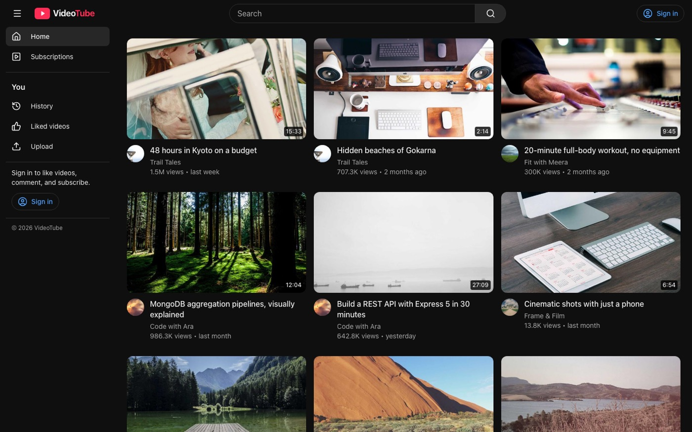
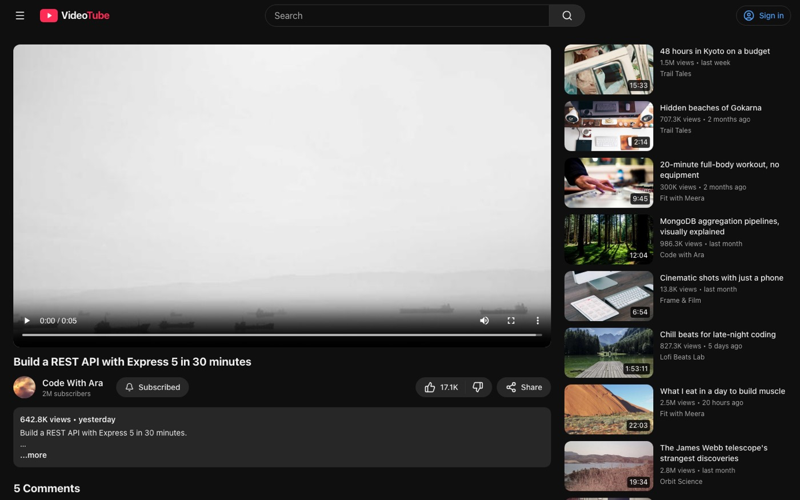
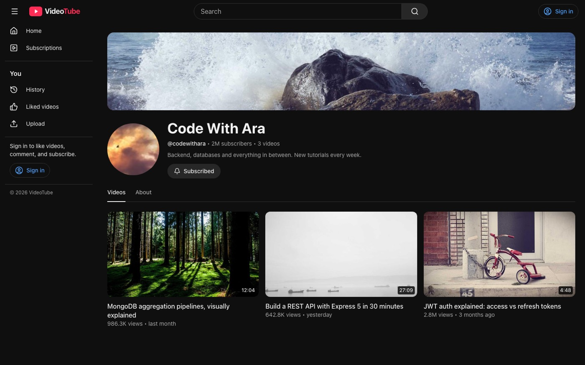
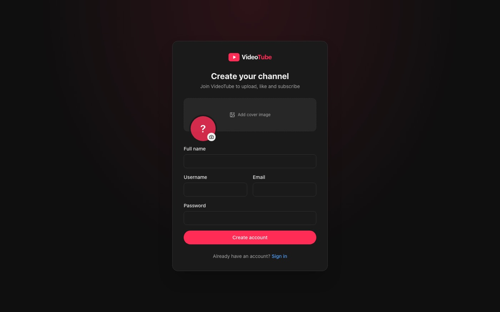

<div align="center">

# 🎬 VideoTube — Frontend

**A YouTube-style web app for the VideoTube backend, built with React, TypeScript and Tailwind CSS.**

Browse and watch videos, create a channel, subscribe to creators, and manage your profile.


</div>

---

## 📸 Screenshots

| Home | Watch |
|---|---|
|  |  |
| **Channel** | **Create account** |
|  |  |

---

## 📖 About

This is the web client for the [VideoTube backend](../README.md). It talks to the Express API for everything account-related and is ready to switch to real video data as soon as the backend's video routes exist.

> 🚧 **Work in progress** — the backend doesn't have video, comment, like or history routes yet, so those screens use **sample data** for now. See [Real vs. sample data](#-real-vs-sample-data).

---

## ✨ Features

| Page | What you can do |
|---|---|
| 🏠 **Home** | Video grid with "Load more" and loading skeletons |
| 🔍 **Search** | Search videos by title or channel |
| ▶️ **Watch** | Video player, like, share (copies link), subscribe, expandable description, comments, "Up next" list |
| 📺 **Channel** | Banner, avatar, subscriber count, *Videos* and *About* tabs; "Customize channel" on your own channel |
| ⬆️ **Upload** | Drag-and-drop video, thumbnail picker, title/description, public or private, live preview with duration |
| ⚙️ **Settings** | Update name & email, change avatar & banner, change password |
| 🕘 **History / 👍 Liked / 📬 Subscriptions** | Your watch history, liked videos, and latest videos from channels you follow |
| 🔐 **Sign in / Register** | Register with avatar + cover image, sign in with username **or** email |

Also included:

- 📱 **Responsive** — collapsible sidebar on desktop, slide-out drawer and full-width search on mobile
- 🔄 **Automatic token refresh** — when the access token expires, the app calls `/refresh-token` once and retries the request
- 🛡️ **Protected routes** — pages like Upload and Settings redirect to sign-in, then send you back where you were
- 🌙 **Dark theme** throughout

---

## 🛠️ Tech Stack

| Purpose | Tool |
|---|---|
| UI | [React 19](https://react.dev/) |
| Language | [TypeScript](https://www.typescriptlang.org/) |
| Build tool / dev server | [Vite](https://vite.dev/) |
| Styling | [Tailwind CSS 4](https://tailwindcss.com/) |
| Routing | [React Router](https://reactrouter.com/) |
| Icons | [Lucide](https://lucide.dev/) |
| Linting | [oxlint](https://oxc.rs/docs/guide/usage/linter) |

No state-management or data-fetching library is needed — auth lives in a React context, and data is loaded with a small `useAsync` hook.

---

## 📁 Project Structure

```
frontend/
├── public/
│   └── favicon.svg
├── src/
│   ├── main.tsx                  # Entry point: router + auth provider
│   ├── App.tsx                   # All routes
│   ├── index.css                 # Tailwind import + theme colors
│   ├── components/
│   │   ├── Layout.tsx            # Navbar, sidebar, drawer, RequireAuth
│   │   ├── VideoCard.tsx         # Grid card, list row, loading skeletons
│   │   ├── SubscribeButton.tsx   # Optimistic subscribe/unsubscribe
│   │   └── ui.tsx                # Button, Field, Avatar, Alert, Spinner…
│   ├── context/
│   │   └── AuthContext.tsx       # Current user, login, register, logout
│   ├── pages/
│   │   ├── Auth.tsx              # Sign in, Register
│   │   ├── Feeds.tsx             # Home, Search, History, Liked, Subscriptions
│   │   ├── Watch.tsx             # Player, actions, comments, up next
│   │   ├── Channel.tsx           # Channel header + tabs
│   │   └── Studio.tsx            # Upload, Settings
│   ├── services/
│   │   └── index.ts              # Every API call in one place
│   └── lib/
│       ├── api.ts                # fetch wrapper: unwraps ApiResponse, refreshes tokens
│       ├── types.ts              # Types matching the Mongoose models
│       ├── mock.ts               # Sample videos/comments until the backend has them
│       ├── format.ts             # 1.2M views, 3 days ago, 12:04
│       └── useAsync.ts           # Data-loading, media-query and file-preview hooks
├── docs/                         # README screenshots
├── vite.config.ts                # Dev proxy to the backend
├── vercel.json                   # Vercel rewrites (SPA + API proxy)
└── package.json
```

---

## 🚀 Getting Started

### Prerequisites

- [Node.js](https://nodejs.org/) (latest LTS recommended)
- The **VideoTube backend** set up and running — see the [backend README](../README.md#-getting-started)

### 1. Start the backend

In the project root (`video-tube/`):

```bash
npm install
npm run dev
```

Wait for `the port is running at 3000`.

### 2. Install the frontend

In a **second terminal**:

```bash
cd frontend
npm install
```

### 3. Run it

```bash
npm run dev
```

Open **http://localhost:5173** 🎉

No `.env` file is needed for local development — the dev server forwards every `/api` request to `http://localhost:3000`.

### Scripts

| Command | What it does |
|---|---|
| `npm run dev` | Dev server with hot reload at `localhost:5173` |
| `npm run build` | Type-check, then build to `dist/` |
| `npm run preview` | Serve the built `dist/` at `localhost:4173` (API proxy included) |
| `npm run lint` | Lint with oxlint |

> ⚠️ **Don't use `npx serve`.** It serves files as-is: the browser can't run the `.tsx` source, `/api` requests never reach the backend, and refreshing any page other than `/` gives a 404. Use `npm run dev` or `npm run preview`.

---

## 🔌 How It Connects to the Backend

```
  Browser ──► Vite dev server (:5173) ──► /api/* forwarded ──► Express backend (:3000)
              serves the React app          same origin, so       MongoDB + Cloudinary
                                            cookies just work
```

Because the browser only ever talks to `localhost:5173`, the backend's login cookies are **same-origin** and CORS never comes into play.

Every request goes through `src/lib/api.ts`, which:

1. Sends cookies (`credentials: "include"`) **and** the access token as a `Bearer` header
2. Unwraps the backend's `ApiResponse` and returns just `data`
3. Throws an error with the backend's `message` when `success` is `false`
4. On a `401`, calls `/user/refresh-token` once and retries the original request

### Backend endpoints used

| Feature | Method | Endpoint |
|---|---|---|
| Register | `POST` | `/user/register` (multipart: `avatar`, `coverImage`) |
| Sign in | `POST` | `/user/login` |
| Sign out | `POST` | `/user/logout` |
| Restore session | `GET` | `/user/current-user` |
| Refresh token | `POST` | `/user/refresh-token` |
| Update name/email | `PUT` | `/user/update-account` |
| Change password | `PUT` | `/user/change-password` |
| Change avatar | `PUT` | `/user/update-avatar` (multipart: `avatar`) |
| Change banner | `PUT` | `/user/update-cover-image` (multipart: `coverImage`) |
| Channel profile | `GET` | `/user/c/:username` |
| Subscribe / unsubscribe | `POST` | `/subscriptions/c/:channelId` |

---

## 🧪 Real vs. Sample Data

| Feature | Source |
|---|---|
| Accounts, sign-in, settings | ✅ Backend |
| Channel pages of registered users | ✅ Backend |
| Subscribing to registered users | ✅ Backend |
| Videos, search, upload | 🧪 Sample data |
| Comments, likes, watch history | 🧪 Sample data |
| Subscriptions feed | 🧪 Sample data |

Sample data lives in `src/lib/mock.ts`, is kept in memory, and resets on page reload. Sample channels (like *Code with Ara*) and their videos only exist in the frontend.

### Switching to real video data

Once the backend has these routes, set `USE_MOCK_VIDEOS = false` in `src/services/index.ts` — the frontend already calls them:

| Feature | Expected endpoint |
|---|---|
| Video feed & search | `GET /videos?page=&limit=&query=` |
| Channel's videos | `GET /videos?username=` |
| Single video | `GET /videos/:videoId` |
| Upload | `POST /videos` (multipart: `videoFile`, `thumbnail`, `title`, `description`, `isPublished`) |
| Comments | `GET` / `POST /comments/:videoId` |
| Like / unlike | `POST /likes/toggle/v/:videoId` |
| Liked videos | `GET /likes/videos` |
| Watch history | `GET /user/history` |
| Subscriptions feed | `GET /videos/subscriptions` |

List endpoints should return the `mongoose-aggregate-paginate-v2` shape (`docs`, `page`, `totalPages`, `hasNextPage`), and each video's `owner` should be populated with `_id`, `username`, `fullname` and `avatar`.

---

## 🌍 Sharing & Deployment

### On another computer on the same Wi-Fi

```bash
npm run dev -- --host
```

Open the **Network** address it prints (e.g. `http://192.168.1.x:5173`) on the other device. Both devices must be on the same network, and some college/office Wi-Fi blocks this.

### With a public link (any network)

Run the app, then in another terminal:

```bash
npx cloudflared tunnel --url http://localhost:4173   # after npm run build && npm run preview
```

Share the `https://…trycloudflare.com` link it prints. `vite.config.ts` already allows `.trycloudflare.com` hosts. Anyone with the link can open the app while the tunnel runs.

### On Vercel

1. Host the backend somewhere that runs a Node server (e.g. [Render](https://render.com/))
2. In `vercel.json`, replace `YOUR-BACKEND-URL` with the backend's address
3. On Vercel, import the repository and set **Root Directory** to `frontend`

`vercel.json` sends every page to `index.html` (so refreshing `/watch/…` works) and proxies `/api/*` to the backend, keeping cookies same-origin just like in development.

---

## 🧰 Troubleshooting

| You see | Cause | Fix |
|---|---|---|
| Blank page | Opened with `npx serve` or by opening `index.html` directly | Use `npm run dev` |
| Sign-in fails with `Request failed (500)` or `(502)`, or every request errors | The backend isn't running | Start it in the project root with `npm run dev` and wait for `port is running at 3000` |
| `Invalid credentials` | Wrong username/email or password | Usernames are stored lowercase; check the password |
| `Avatar is required` / `Cover image is required` on register | The backend requires both images | Pick a cover image **and** click the round avatar to add a profile picture |
| Signed out after every reload on another device | The backend's cookies are `secure`, so browsers drop them on plain `http://192.168.x.x` | Use `localhost`, or an `https` link (tunnel or Vercel) |
| `Blocked request. This host is not allowed` | Opening the app through an unknown domain | Add the domain to `allowedHosts` in `vite.config.ts` |
| A sample channel or video is missing after reload | Sample data is in-memory only | Expected — it resets on reload |
| `Port 5173 is in use` | Another dev server is already running | Stop it, or open the port Vite suggests |

---

## 🗺️ Roadmap

- [x] Layout: navbar, collapsible sidebar, mobile drawer
- [x] Sign in, register, sign out, session restore, token refresh
- [x] Home, search, watch, channel pages
- [x] Upload page with preview
- [x] Settings: profile, avatar & banner, password
- [x] History, liked videos, subscriptions feed (sample data)
- [ ] Switch videos, comments, likes and history to the real backend
- [ ] Playlists
- [ ] Light theme
- [ ] Tests
